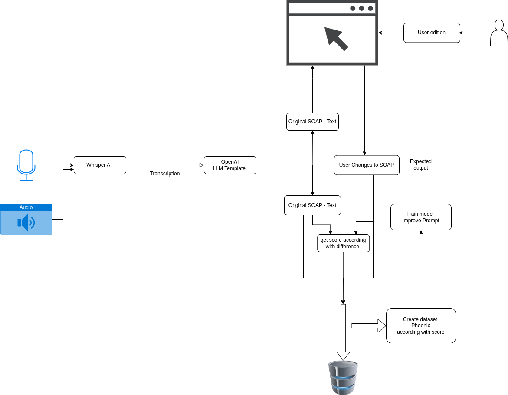

## Main Features

-  Audio Upload (simulated via file input)
-  Transcription using Whisper 
-  Note generation using OpenAI GPT 
-  Editable notes with feedback interface
-  Automatic scoring between generated and final notes.( it is saved in DB for future improvments, those changes can be applied to transcription - note and note - note edited)
-  Feedback loop integration for prompt improvement
-  Dockerized and ready for deployment

---

##  Tech used

- Python 3.10
- Flask
- OpenAI GPT 
- SQLite 
- Docker 
- phoenix ( also I could suggest to use langchain but in case to apply more complex architecture, it depends of multiple points)


---
## Diagram 


## Prompt Versioning

Prompt templates are managed through a `PROMPT_LIBRARY` dictionary allowing experimentation and scoring per prompt version (e.g., `v1`, `v2`, `v3`, `v4`).The version used in the 

The scoring loop is implemented using a specialized prompt that compares the draft and final version of a SOAP note:

```
You are a clinical documentation evaluator.

Your task is to compare two versions of a medical SOAP note: an initial draft generated from transcription and a final version edited by a clinician.

Draft Note:
"""{draft_note}"""

Final Note:
"""{final_note}"""

Evaluate the draft in terms of:
- Accuracy: Does the draft capture the correct medical facts?
- Completeness: Are all relevant findings and plans included?
- Clinical correctness: Is the content medically sound?

Give a single score from 0 to 100 based on how close the draft is to the final version:
- 100 = identical and perfect
- 80–99 = minor edits (grammar, formatting, slight corrections)
- 50–79 = significant clinical or structural changes
- < 50 = mostly incorrect or incomplete

Return only the numerical score. Do not include any explanation.
```


This feedback loop allows for evaluation and dataset generation, which can later be used for fine-tuning or for prompt experiments monitored with Phoenix.However we can do deep experiments doing improvement to model and adding agents to lauch multiple modes depending of doctor's specialty and template choosen.
## Experimentation.
Prompt templates are managed through a PROMPT_LIBRARY dictionary allowing experimentation and scoring per prompt version (e.g., v1, v2, v3, v4).

The scoring loop is implemented using a specialized prompt that compares the draft and final version of a SOAP note:

---

## Project Structure

```
├── app.py                      # Flask app & API routes
├── main.py                     # Transcription & helper functions ( used such a test in the begining - )
├── prompts.py                  # Prompt templates and helper functions
├── images/
├── db/
│   └── note_repository.py      # SQLite database logic
|   └──database.db
├── templates/
│   └── index.html              # web UI
├── requirements.txt            # Dependencies in case
├── Dockerfile                  # Docker setup
```

---

##  Run with Docker 

Requiremnts :
-  Docker installed.
-  Open two terminals. 

Terminal 1 : 
```bash
docker run --rm -t --net=host  --name transcription-app edgarfra6/transcription-app:latest 
```

```bash
docker run -p 6006:6006 -p 4317:4317 -i -t arizephoenix/phoenix:latest 
```
- Visit [http://localhost:5000](http://localhost:5000)
- Phoenix [http://localhost:6006](http://localhost:6006)

- Once the edited note is saved you need to wait until a pop up comes up that says the score. 
- docker exec transcription-app bash ( it is for  database analize)

### Run locally - Set up virtual environment and install dependencies.

```bash
python -m venv venv
source venv/bin/activate
pip install -r requirements.txt
```

###  Add your `.env` file
```
OPENAI_API_KEY=sk-...
```

###  Run the app
```bash
flask run
```

Visit [http://localhost:5000](http://localhost:5000)

---


##  Environment Variables

- I put my key with limit for make it easier. ( it was for Docker image)

---
## Build image 

docker build -t user/transcription-app:latest .

##  Future Improvements

- LLM fine-tuning with clinician feedback
- Prompt score visualization dashboard
- improve the prompt , but i think that the model need to be trained maybe for each medical specialization and use agents to manage the flow depending and implement a deep architecture of agents and 

---


